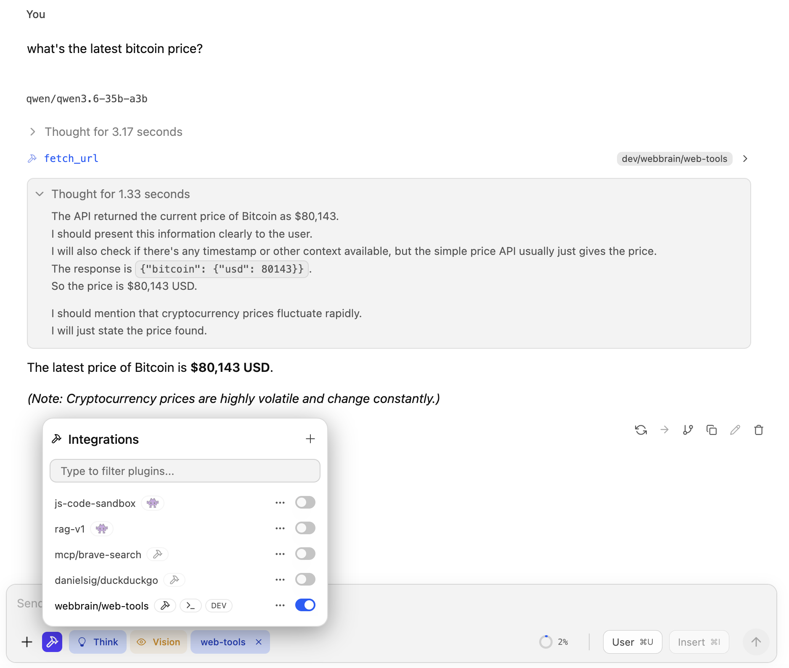

# WebBrain Web Tools — LM Studio plugin

Give any LM Studio model the ability to read the live web. Two tools,
no browser required:

- **`fetch_url`** — raw HTTP fetch with content-type smarts. JSON gets
  pretty-printed, HTML is stripped to readable text + `<title>`,
  plain text comes back verbatim, binaries are summarised instead of
  inlined.
- **`research_url`** — same fetcher, biased toward "give me the
  article body, not the navigation chrome." Extracts `<main>` /
  `<article>`, drops header/nav/footer/aside before stripping tags.
  Best for news, blog posts, READMEs, Wikipedia, docs.

Pure Node — no Puppeteer, no Playwright, no headless Chromium.
Same fetching logic the [WebBrain](https://webbrain.one) browser
extension ships, ported off `chrome.*` onto Node `fetch`.



## Install

```bash
lms clone webbrain/web-tools
```

That pulls the plugin from LM Studio Hub into your local plugins
directory. Open LM Studio, click the integrations icon next to the
chat input, and toggle **webbrain/web-tools** on (see screenshot
above). Any tool-capable model in the same chat can now call
`fetch_url` and `research_url`.

Try it:

> What's on the front page of news.ycombinator.com right now?

The model should call `research_url` and come back with live
headlines.

## What this plugin can't do

Listed up front so it doesn't bite you mid-session:

- **No JavaScript rendering.** Single-page apps that hydrate from
  JSON (Twitter, Notion, modern dashboards) return near-empty text.
  The plugin flags this with `spaSuspected: true` so the model can
  give up gracefully instead of looping.
- **No clicks, no typing, no screenshots.** Those need a real
  browser. The WebBrain extension does that; this plugin is the
  read-only subset.
- **No cookies, no login.** Each fetch is anonymous from your IP
  with no shared session — pages behind a login are out of reach.

If you need any of the above, install the [WebBrain browser
extension](https://webbrain.one) instead (or alongside) — same
model server, full agent loop with browser interaction.

## Develop locally

If you want to hack on the plugin, clone this repo (rather than
`lms clone` the published artifact) and:

```bash
npm install
lms dev
```

`lms dev` bundles `src/` and registers the plugin live with your
running LM Studio instance — edits to TypeScript files hot-reload
without a restart. The `dist/` build via `npm run build` is only
needed if you want to import the tool implementations from another
Node project.

### File layout

```
.
├── manifest.json          ← LM Studio plugin metadata
├── package.json           ← npm deps + build scripts
├── tsconfig.json          ← strict-mode TS, ES2022
└── src/
    ├── index.ts           ← plugin registration glue
    ├── tools/
    │   ├── fetchUrl.ts    ← fetch_url implementation
    │   └── researchUrl.ts ← research_url implementation
    └── util/
        ├── htmlToText.ts  ← regex HTML stripper
        ├── safeFetch.ts   ← redirect-revalidating wrapper + streaming cap
        └── urlGuard.ts    ← private-IP / file:// blocker
```

`tools/` and `util/` are pure functions with no SDK dependency — you
can `import` them from any Node project that wants the same
web-fetching primitives.

## Safety notes

The plugin runs in your local Node process, so anything reachable
from that process is reachable from the LLM. The defenses below are
layered — each closes a class of bypass the previous one missed —
but DNS rebinding is a known residual gap (see end of this section).

- **URL guard, structural (sync).** Requests to RFC1918 (`10.*`,
  `172.16-31.*`, `192.168.*`), loopback (`127.*`, `::1`), link-local
  (`169.254.*`, `fe80::/10`), unique-local IPv6 (`fc00::/7`),
  cloud-metadata IPs, and `*.local` / `*.internal` / `*.lan` /
  `*.home` / `*.corp` / `*.intranet` are blocked. Non-`http(s)`
  protocols (`file://`, `ftp://`, `gopher://`, `javascript:`) too.
- **DNS resolution check.** Before each hop, the hostname is
  resolved via `dns.lookup({all: true})` and every returned A/AAAA
  address is checked against the same private ranges. Closes the
  bypass where `attacker.example A 127.0.0.1` would otherwise pass
  the syntactic check.
- **Per-redirect re-validation.** Redirects are followed manually
  (5 hops max). Each `Location` runs through both checks before we
  follow it — a public URL cannot 302 to `http://169.254.169.254/...`.
- **Cross-origin header stripping.** When a redirect crosses origins,
  `Authorization`, `Cookie`, `Proxy-Authorization`, and
  `Proxy-Authenticate` headers are dropped. Stops credentials passed
  via the per-call `headers` arg from leaking through an open-redirect
  chain.
- **Streaming response cap.** Bodies read with a hard byte ceiling
  (4 MB for `fetch_url`, 6 MB for `research_url`). Past the cap, the
  stream is cancelled and the result is marked `truncated: true`.
- **No `credentials: 'include'`.** Unlike the browser extension,
  this plugin makes anonymous requests.
- **Timeouts.** Default 30 s, hard cap 120 s.

Set `allowPrivate: true` on a per-call basis to opt out of the URL
guard + DNS check — useful when you actually want to talk to
localhost services.

### Known residual gap: DNS rebinding

An attacker controlling a domain with TTL=0 can return a public IP
when our guard runs `dns.lookup` and a private IP a moment later when
`fetch` connects. Closing this fully requires pinning the resolved
IP via a custom `undici` Agent's `connect.lookup` hook so the
connection uses the exact address we validated. Tracked as a
follow-up. If you're running this on a cloud VM with sensitive
instance-metadata endpoints, use a network policy that blocks
`169.254.169.254` outbound rather than relying solely on this
plugin's checks.

## License

MIT, same as the rest of WebBrain. See `../LICENSE`.
